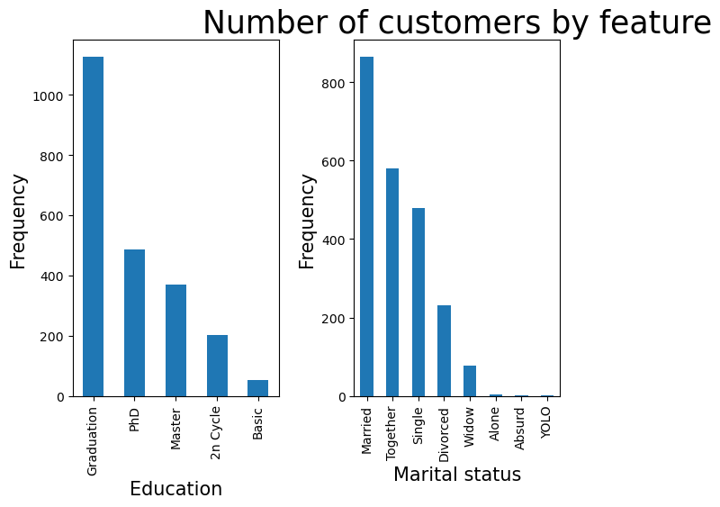
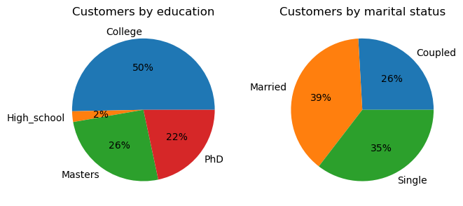
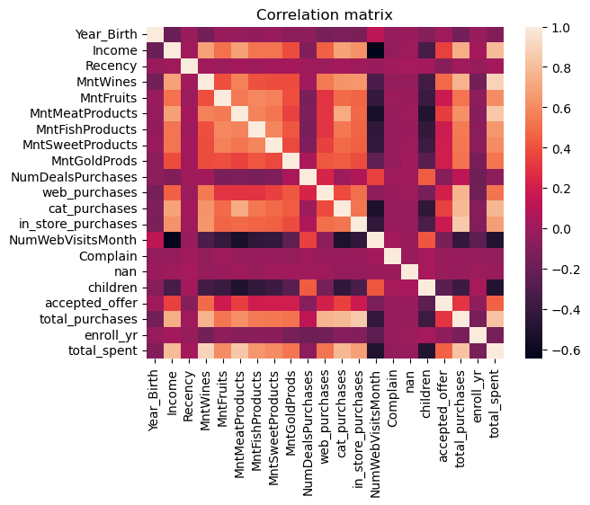

# Unsupervised Machine Learning
## Clustering algorithms to segment customers by attributes and purchasing habits

*Companies who understand their customers and their behavior have an advantage over their competitors.  These understandings help companies know what messages will resonate with them and how to attract and retain these customers.  Insights into customers and purchase behavior can also help companies know how to attract certain types of customers and increase certain types of purchase behavior.  As of 2022, e-commerce accounts for nearly 19% of all purchases, and this is expected to continue increasing over the next few years.[^1]  Our client, a grocery store chain, wants to use these types of insights to increase online purchases from their customers.*

# Method

1. **Project proposal:**  Suggested plan for research methods and objectives

2. **Data wrangling:**  Found, imported, cleaned, and transformed data to prepare for analysis

3. **Exploratory data analysis:**  Examined the dataset to find patterns and insights and created graphics to visualize the data

4. **Develop machine learning algorithms:**  Created, evaluated, compared, fine-tuned, and improved models to determine which was best in this context

5. **Modeling:**  Used the chosen model to create clusters of the business's customers
   
6. **Conclusions and recommendations:**  Examined the resulting clusters and recommended future business actions

 &nbsp;   
***Final model:   KMeans clustering***
     
The algorithm that performed best and created the most useful clusters of customers was a KMeans clustering algorithm.  These clusters are created by examining the distance between each data point, which represents individual customers, and grouping those points that are the closest to each other into one algorithm and those that are farthest into different clusters.  Closeness is distance represents customers that have the most similarities in the attributes contained in this data, while points that are farther away show less similarity between customers.  When a clustering model performs well with the data it's given, the model results in clusters that are dense and distinct.  This is the case for the model we developed in this project.

# 1. Data   

“Customer personality analysis” dataset created by Dr. Omar Romero-Hernandez and uploaded to kaggle by Akash Patel 

[Original dataset from Kaggle](https://www.kaggle.com/datasets/imakash3011/customer-personality-analysis)

### About the dataset:
This is a 220.19 kB public domain csv file containing 2240 observations with the following 29 variables:
#### Demographics
* ID: Customer's unique identifier    
* Year_Birth: Customer's birth year    
* Education: Customer's education level     
* Marital_Status: Customer's marital status    
* Income: Customer's yearly household income     
* Kidhome: Number of children in customer's household     
* Teenhome: Number of teenagers in customer's household     
* Dt_Customer: Date of customer's enrollment with the company    
* Recency: Number of days since customer's last purchase    
* Complain: 1 if the customer complained in the last 2 years, 0 otherwise     
#### Purchases
* MntWines: Amount spent on wine in last 2 years     
* MntFruits: Amount spent on fruits in last 2 years     
* MntMeatProducts: Amount spent on meat in last 2 years    
* MntFishProducts: Amount spent on fish in last 2 years    
* MntSweetProducts: Amount spent on sweets in last 2 years    
* MntGoldProds: Amount spent on gold in last 2 years    
#### Discounts
* NumDealsPurchases: Number of purchases made with a discount    
* AcceptedCmp1: 1 if customer accepted the offer in the 1st campaign, 0 otherwise    
* AcceptedCmp2: 1 if customer accepted the offer in the 2nd campaign, 0 otherwise    
* AcceptedCmp3: 1 if customer accepted the offer in the 3rd campaign, 0 otherwise     
* AcceptedCmp4: 1 if customer accepted the offer in the 4th campaign, 0 otherwise     
* AcceptedCmp5: 1 if customer accepted the offer in the 5th campaign, 0 otherwise    
* Response: 1 if customer accepted the offer in the last campaign, 0 otherwise       
#### Shopping habits
* NumWebPurchases: Number of purchases made through the company’s website     
* NumCatalogPurchases: Number of purchases made using a catalog    
* NumStorePurchases: Number of purchases made directly in stores     
* NumWebVisitsMonth: Number of visits to the company’s website in the last month      

# 2. Data wrangling    
[Data wrangling notebook](clustering/2_data_wrangling_3_eda.ipynb)

In a collaborative-filtering system there are only three columns that matter to apply the machine learning algorithms: the user, the item, and the explicit rating (see the example matrix above). I also had to clean & normalize all the reference information (location, difficulty grade, etc.) to the route so that my user could get a useful and informative recommendation.

* **Problem 1:** Missing values:  24 of the 2240 rows contained a missing value for the column income.  Before changing or removing these observations, I wanted to be sure that there are not any trends among these values that might affect our analysis.  I compared the rows that had a missing value with the averages of all other rows for each variable.  There was not a significant difference between other rows and those with missing values.  **Solution:** I imputed the missing income values with the mean value for income across the dataset.

* **Problem 2:** Some values given for categorical variables were in a different format than others.  Some appeared to be added as a joke, such as the values "Absurd" and "YOLO" in the column for relationship status.  **Solution:** For the education variable, I looked for information to learn which of the unknown labels were most equivalent to the education system in the US, as that is what I am most familiar with.  I then replaced the terms, "Basic," "2n cycle," with "High School" and "Master's" so that the format was the same across all observations.  I dropped the rows with "Absurd" and "YOLO" for relationship status as I had no way to determine what the true response should have been, nor was there any average value for that feature that I might use to impute them.

* **Problem 3:** There were more features than we would use for our analysis.  Machine learning algorithms can manage extremely large datasets with many dimensions, but each dimension adds complexity and can increase the time required to train and test models.   **Solution:** While I did drop unnecessary columns such as customer ID number, I wanted to maintain as many features as were possibly useful.  Therefore, I combined features such as "Kidhome" and "Teenhome" into a single feature for customers who had a child or children at home.  

# 3. Exploratory data analysis 
[EDA notebook](clustering/2_data_wrangling_3_eda.ipynb)     

Customers' education and marital status before cleaning (bar graph on left) and after cleaning (pie chart on right) category labels

     

Visualizing the correlation between each combination of variables in the cleaned dataset
     

     
            
# 4. Preprocessing and training      
[Preprocessing notebook](clustering/4_preprocess_train_5_modeling.ipynb)     
     
I created a basic pipeline that will impute any missing values and scale the data.  This pipeline can then be used to train various models with the data it has prepared.  I tried various models, first with default hyperparameters, and then fine-tuned hyperparameters for each algorithm.  I evaluated each model using silhouette score to compare the performance of each.
      
# 5. Algorithms and Machine Learning     
[Modeling notebook](clustering/4_preprocess_train_5_modeling.ipynb)     

# 6. Conclusions and recommendations
[Presentation](clustering/6_presentation.pdf)

# Credits

Special thanks to Silvia Seceleanu for her guidance and support.  Credit to Springboard for curriculum and project design.  Cover image by Priscilla Du Pree found on Unsplash.com.

[^1]:  Daniela Coppola, publisher.  “E-commerce as percentage of total retail sales worldwide from 2015 to 2027.”  www.statista.com/statistics/534123/e-commerce-share-of-retail-sales-worldwide/#statisticContainer .  Published Aug 29, 2023.  Accessed Sept 18, 2023.
