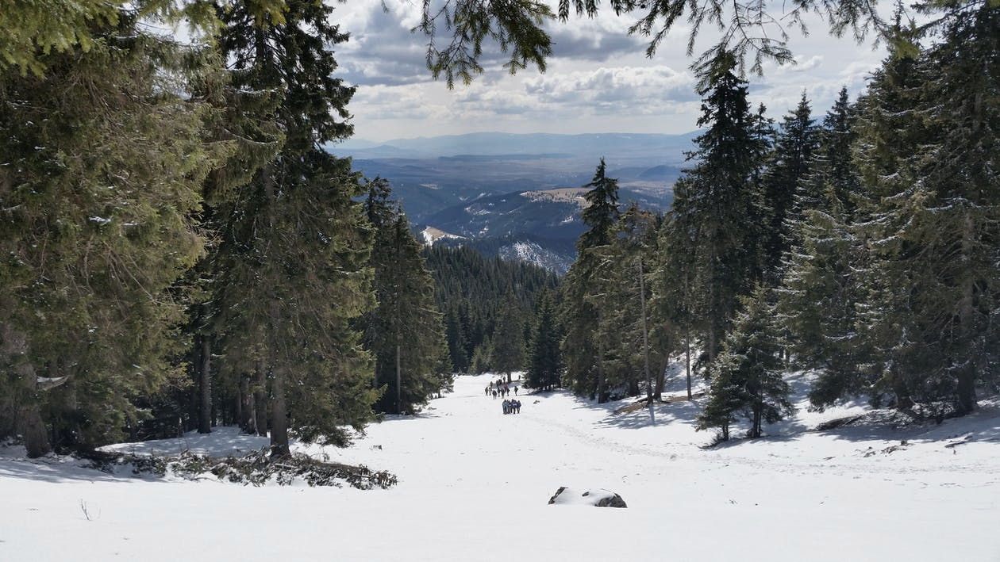
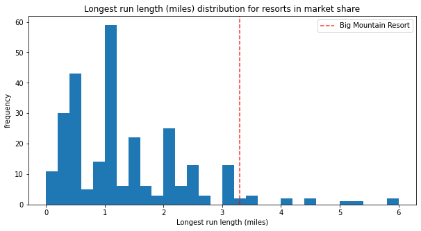
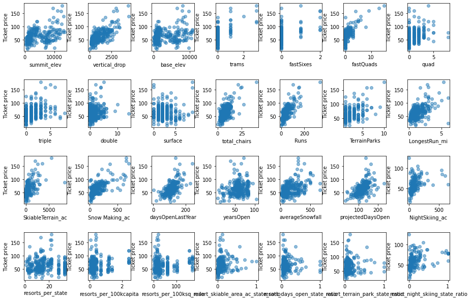

# Big Mountain Ski Resort
## Using random forest modeling to maximize business profits

*Random forest regression is a powerful machine-learning algorithm that analyzes complex datasets and accurately predicts continuous values.  This predictive model can provide invaluable insights to guide businesses in decision-making.  In this project, various predictive models are created and compared to guide a fictitious ski resort in setting the ideal ticket price to maximize profits.*

# Method

1. **Project proposal:**  Suggested plan for research methods and objectives

2. **Data wrangling:**  Found, imported, cleaned, and transformed data to prepare for analysis

3. **Exploratory data analysis:**  Examined the dataset to find patterns and insights and created graphics to visualize the data

4. **Develop machine learning algorithms:**  Created, evaluated, compared, fine-tuned, and improved models to determine which was best in this context

5. **Modeling:**  Used the chosen model to predict which business decisions will best serve the company and maximize profit
   
6. **Conclusions and recommendations:**  Examined the results and recommended future business actions

 &nbsp;   
***Final model:   Random Forest Regression***
     
The algorithm that performed best for determining what ticket price is best for the resort was a random forest regression model.  One of the reasons for choosing this model is that the random forest regression had a smaller mean absolute error than using the mean or the linear regression model.  The random forest model also provided more detailed business insights, such as which features of the resort had the largest impact on business outcomes.
      
# 1. Background
[Problem identification](./01_problem_identification.pdf)

Big Mountain Resort offers access to 105 trails and spectacular views of Glacier National Park and Flathead National Forest and hosts about 350,000 visitors each year. The resort has remarkable facilities, including a newly installed additional chair lift.  

Using data from the resort and its competitors, we can identify opportunities for the resort to make the most of its current facilities, set the best possible ticket prices, ensure that new investments pay off, and plan for the most profitable future.
      
## About the data:
The dataset used for this project is for practice purposes and contains partly fictional data.  Provided by Springboard curriculum, this information was contained in a single CSV file with about 330 observations.  For each resort, the dataset contains data about the following variables:

#### *Resort information*
* Name: name of the resort   
* Region: the region that contains the resort (divided primarily the same as state divisions, though with some exceptions)   
* state: the state in which the resort resides
#### *Resort features*
* summit_elev: elevation above sea level at the summit of ski slopes (in feet)
* vertical_drop: difference in elevation over the distance of ski slope (in feet)
* base_elev: elevation above sea level at the base of ski slopes (in feet)
* trams: number of trams for transporting visitors
* fastEight: number of eight-person detachable chairlifts
* fastSix: number of six-person detachable chairlifts
* fastQuads: number of four-person detachable chairlifts
* quad: number of four-person chairlifts
* triple: number of three-person chairlifts
* double: number of two-person chairlifts
* surface: number of surface lifts
* total_chairs: number of chairs in chair lift(s)
* Runs: number of total ski runs
* TerrainParks: number of terrain or snow parks
* LongestRun_mi: length of the longest ski run (in miles)
#### *Resort logistics*
* daysOpenLastYear: number of days open the previous year
* yearsOpen: number of years the resort has been open total
* averageSnowfall: average amount of snowfall in inches
* SkiableTerrain_ac: number of acres available for skiing
* SnowMaking_ac: number of acres available for making snow
* projectedDaysOpen: the anticipated number of days a resort is likely to be open during the following year
* NightSkiing_ac: number of acres available for skiing after dark
#### *Ticket price information*
* AdultWeekday: price for an adult for one weekday
* AdultWeekend: price for one adult for one weekend day
     
# 2. Data wrangling
[Data wrangling notebook](./02_data_wrangling.ipynb)

Before analysis can begin, the raw data must be examined and cleaned.  Identifying and correcting, fixing, or removing any inaccurate and inconsistent data will ensure that analysis and modeling are as reliable and useful as possible.

* **Problem 1:** Missing values:  13 of the 27 columns contained at least one missing value.  Some of the missing values may represent zeros or categories that do not apply to certain resorts.  For example, when a resort has no fast lifts, these columns may be left blank rather than filled with a zero in each of the columns for types of fast lifts.  However, about 16% of the resorts are missing ticket pricing information.  As one of the ways we might help our resort estimate an ideal ticket price is to compare to prices at similar resorts, this information is essential.  These missing values should not imply that the ticket price of each resort would be $0.  Additionally, all but one value in the fastEight category is 0 and half the values are missing.  **Solution:** Rather than make assumptions about the missing prices, which could drastically affect our later recommendations, I dropped rows that contained no information about ticket price.  However, resorts that gave one ticket price, either in the weekend or weekday price category, were retained and could be used for insights and comparisons.  Since only one resort provided any information about fastEight chair lifts, I chose to drop the category.

* **Problem 2:** Incorrect information:  Examining the distribution for various resort features highlights some specific concerns.  SkiableTerrain_ac values are clustered at the low end as is Snow Making_ac.  FastSixes has a bit more variability, but most values are still 0. Trams also may be a concern for the same reason.  In yearsOpen, most values are low but there is one large value of 2019, which strongly suggests someone recorded calendar year the resort opened rather than the number of years.  **Solution:** I isolated suspicious values and completed additional research to verify whether any of these needed to be corrected.  For example, skiable terrain for Silverton Mountain was listed as 26819 acres, but this seemed significantly higher than for any other resort.  Through additional research, I discovered that this value should instead be 1819 acres and was able to correct the incorrect data.  I also chose to drop the single resort listed as being open for over 2000 years rather than risk changing the given information.

# 3. Exploratory analysis
[Exploratory data analysis notebook](./03_exploratory_data_analysis.ipynb)

Visualizing the frequency of resort features from all ski resorts compared with Big Mountain resort (shown by red dashed line)

   

Visualizing the correlation between ticket price and each ski resort feature
     

# 4. Preprocessing and training models
[Preprocessing notebook](./04_preprocessing_and_training.ipynb)

# 5. Predictive modeling
[Modeling notebook](./05_modeling.ipynb)

# 6. Conclusions and recommendations
[Presentation for business leaders](./06_presentation.ipynb)     

[Project Report](./07_project_report.ipynb)
